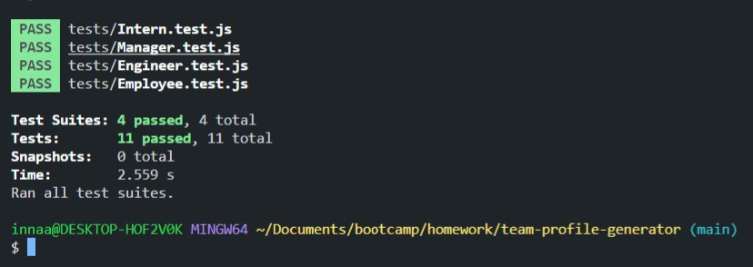
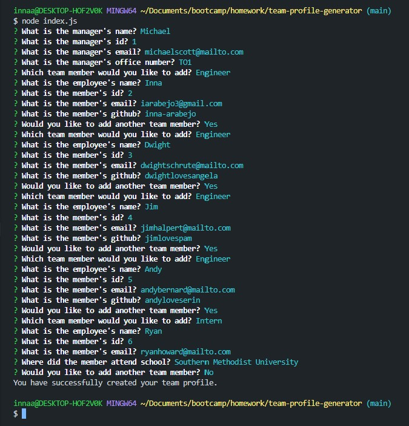
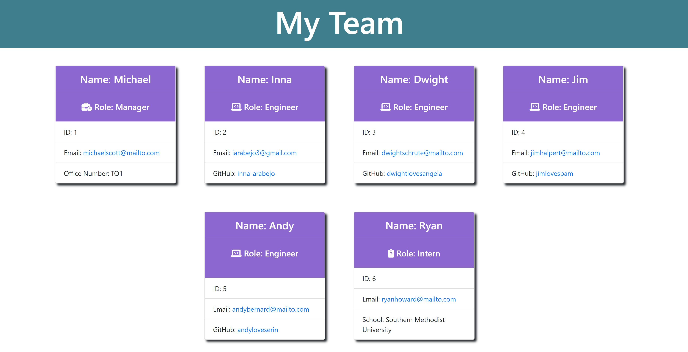

# Team Profile Generator


## Description
Build a team profile generator that gives managers quick access to employee emails and GitHub profiles. Each profile will have the employee's name, id, and email. The employees consist of the manager, engineer and intern. The office number will be added to the manager's profile, a github link is added to the engineer's profile, and the school the intern went to. You will be using Node.js command-line application which will generate an HTML webpage that displays summaries for each person. Testing is key to making code maintainable, so you'll also write a unite test for every part of your code and ensure that it passes each test.

## Table of Contents
* [Installation](#installation)
* [Task](#task)
* [Screenshots](#screenshots)
* [Video](#video)
* [Tests](#tests)
* [License](#license)
* [Questions](#questions)

## Installation
Please install the following dependencies to run the application. 
* [npm inquirer package](https://www.npmjs.com/package/inquirer)
* [npm jest package](https://www.npmjs.com/package/jest)

## Task
In order to use this application, the following requirements are met when:
```md
GIVEN a command-line application that accepts user input
WHEN I am prompted for my team members and their information
THEN an HTML file is generated that displays a nicely formatted team roster based on user input
WHEN I click on an email address in the HTML
THEN my default email program opens and populates the TO field of the email with the address
WHEN I click on the GitHub username
THEN that GitHub profile opens in a new tab
WHEN I start the application
THEN I am prompted to enter the team manager’s name, employee ID, email address, and office number
WHEN I enter the team manager’s name, employee ID, email address, and office number
THEN I am presented with a menu with the option to add an engineer or an intern or to finish building my team
WHEN I select the engineer option
THEN I am prompted to enter the engineer’s name, ID, email, and GitHub username, and I am taken back to the menu
WHEN I select the intern option
THEN I am prompted to enter the intern’s name, ID, email, and school, and I am taken back to the menu
WHEN I decide to finish building my team
THEN I exit the application, and the HTML is generated
```

## Screenshots




## Video

[Team profile generator walkthrough video](./assets/images/walkthrough-video.mp4)

## Tests
The application must include `Employee`, `Manager`, `Engineer`, and `Intern` classes. The tests for these classes (in the `tests` directory) must ALL pass. To start running the test, in the command-line type "`npm run test`".
To generate user-input in the command-line, type "`node index.js`".

## License
 This project is covered under MIT.

## Questions
For inquiries about the repo, you can find me through GitHub at [inna-arabejo](https://github.com/inna-arabejo). 
For any additional questions, you can reach me through my email at [iarabejo3@gmail.com](mailto:iarabejo3@gmail.com).